# Домашнее задание к занятию "Java"

Итак, для того чтобы начать программировать, вам нужна специальная программа. С этого мы и начнем! Ваша задача подготовиться к дальнейшим занятиям, скачать, установить и настроить IDE. Вперед!)

Для выполнения задания и дальнейшего прохождения курса требуется компьютер с операционной системой Windows, MacOS или Linux

------

### Инструкция по установке IntelliJ IDEA

Шаг 1. Перейдите по адресу [Intellij Idea, версия Community](https://www.jetbrains.com/ru-ru/idea/), нажмите кнопку "Скачать":

Шаг 2. Выберите необходимую ОС (Windows, macOS, Linux):

Шаг 3. В разделе Community нажмите кнопку "Скачать":

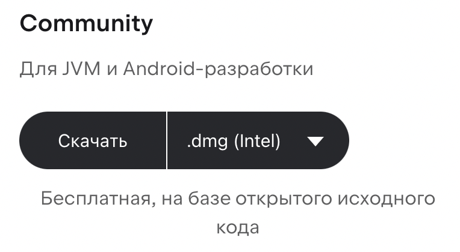

Шаг 4. Дождитесь загрузки файла, запустите его, и нажмите кнопку "Установить". Дождитесь завершения установки и нажмите кнопку "Готово"

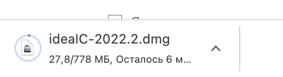

Шаг 5. Прочитайте лицензионное соглашение, поставьте галочку и нажмите кнопку "Continue":

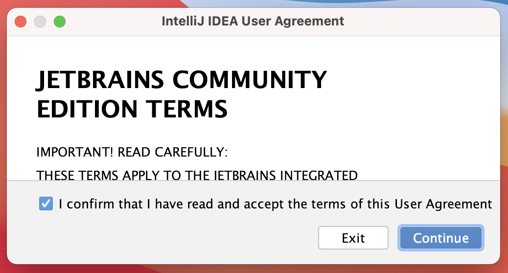

Шаг 6. Далее выйдет окно с просьбой помочь IntelliJ IDEA улучшить свои продукты, отправляя анонимные данные об используемых функциях и плагинах, конфигурации оборудования и программного обеспечения, статистику по типам файлов, количеству файлов в проекте и т. д. Если вы не хотите делиться данными, выберите кнопку "Don't Send". Если вы хотите делиться данными, выберите кнопку "Send Anonymous Statistics":

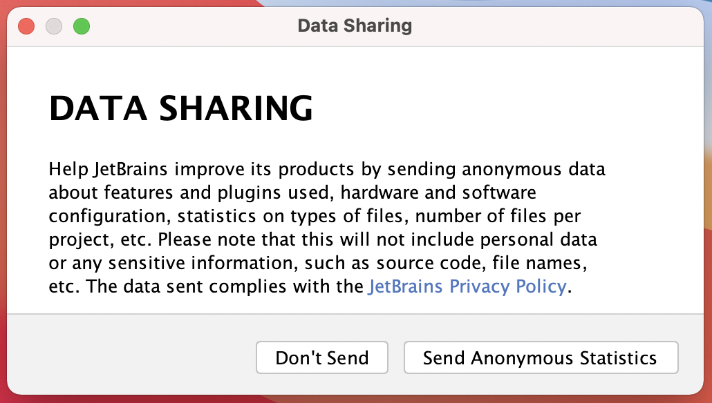

Шаг 7. У вас откроется стартовое программы:

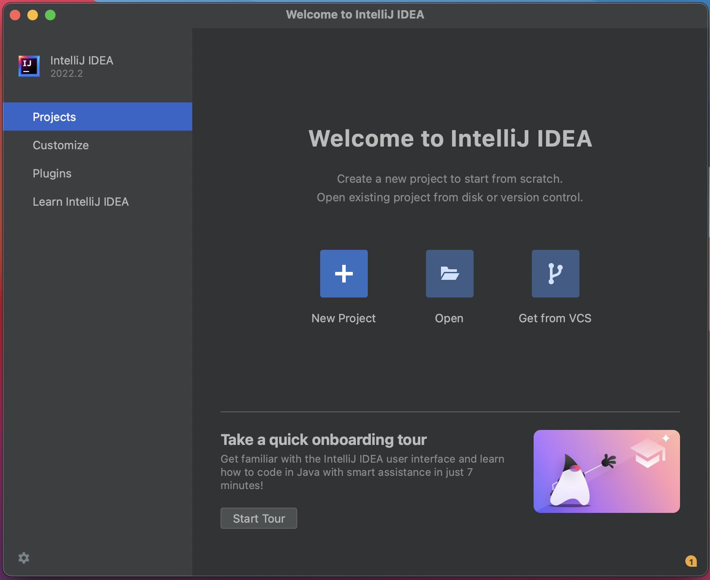

Шаг 8. Нажмите кнопку "New Project":

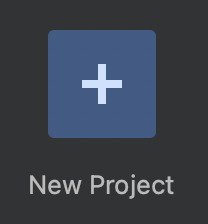

Шаг 9. В появившемся окне в поле "Language" выберите "Java", в поле "System" выберите "IntelliJ":

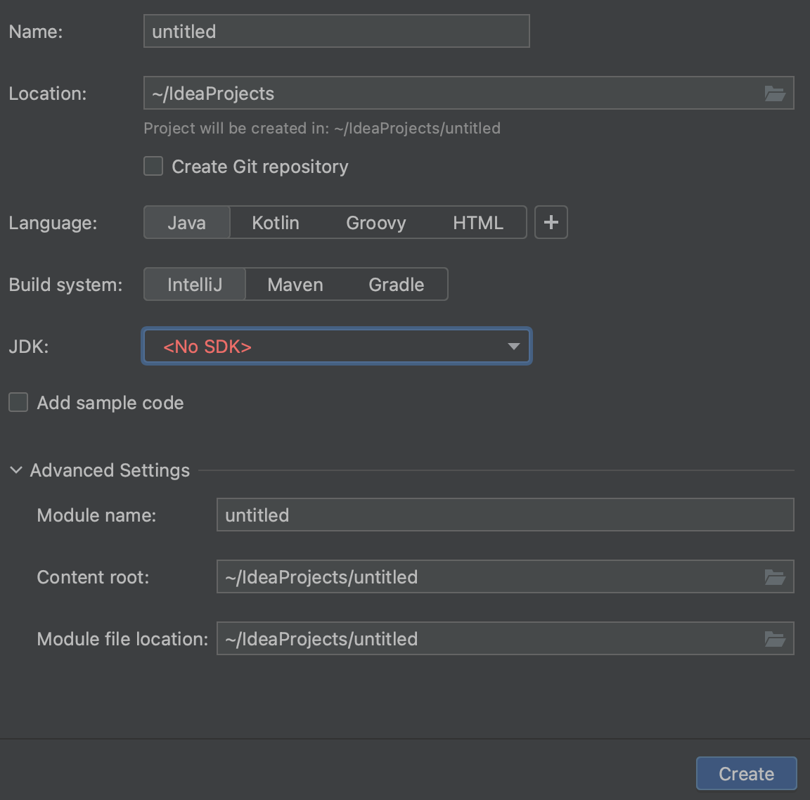

Шаг 10. В поле "JDK" выберите "Download JDK" 

Шаг 11. В появившемся окне в поле "Version" выбираем "17" и нажимаем кнопку "Download"

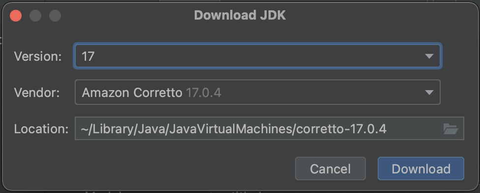

Шаг 12. Дождитесь загрузку, затем появится окно, в котором в поле "JDK" выбрана версия 17. Теперь в правом нижнем углу нажмите кнопку "Create": 

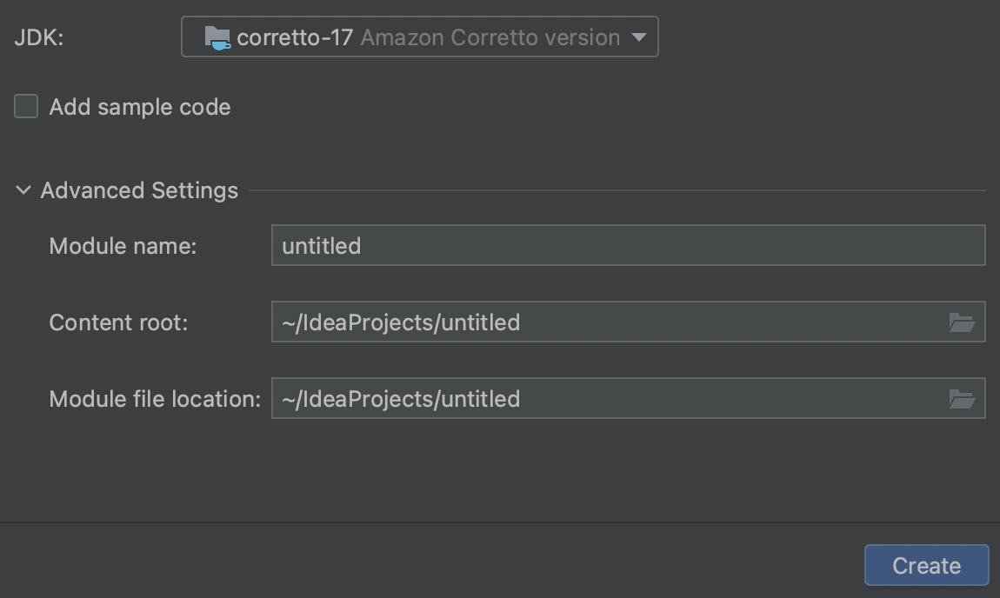

Шаг 13. При первом запуске IntelliJ IDEA понадобится какое-то время, чтобы проиндексировать вашу установку JDK. Это отобразится в правом нижнем углу окна, подождите, пока все процессы завершатся:

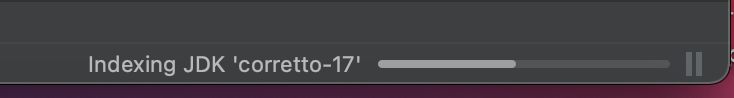

Шаг 14. Перед вами панель проекта. Папки называются каталоги. Вы видите вложенность одних папок в другие - это структура каталогов:

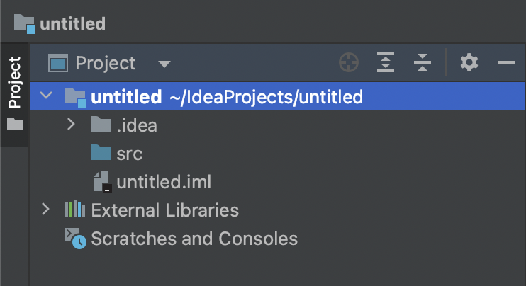

Шаг 15. На каталог `src` щёлкните правой кнопкой мыши и выберите "New" -> "Java Class":

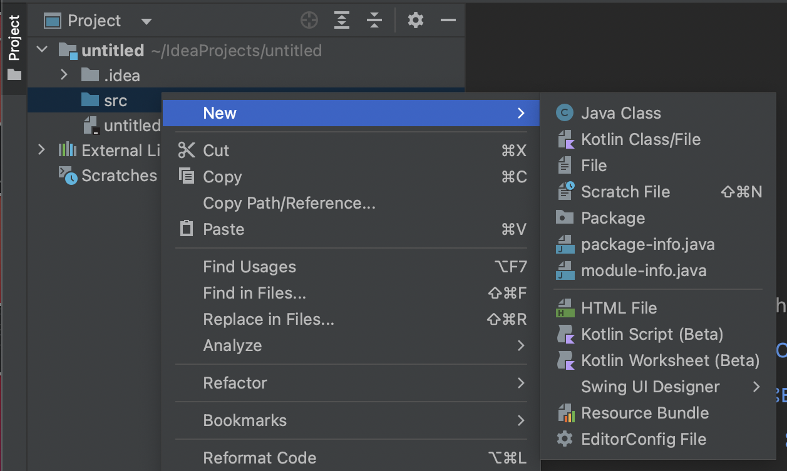

Шаг 16. В открывшемся окне введите `Main` и нажмите клавишу "Enter":

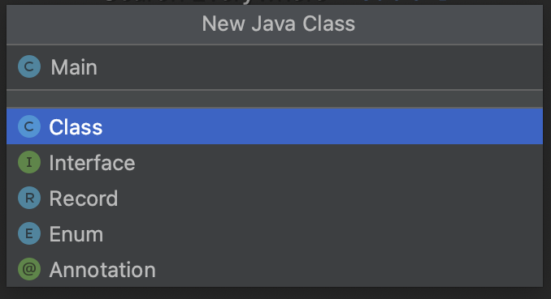

Шаг 17. Замените содержимое открывшегося файла [кодом](https://github.com/netology-code/jdfree-homeworks/blob/main/01/Example.java), чтобы текущее состояние соответствовало тому, что вы видите на экране:

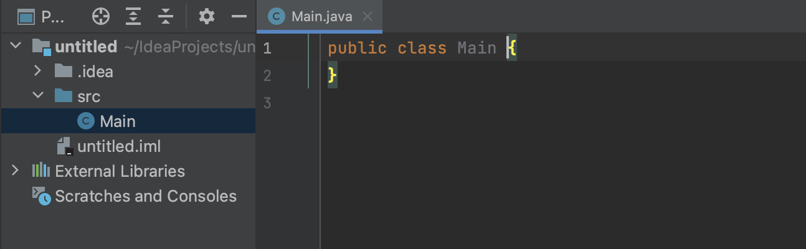

Шаг 18. 

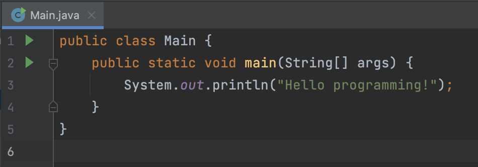

Шаг 19: 

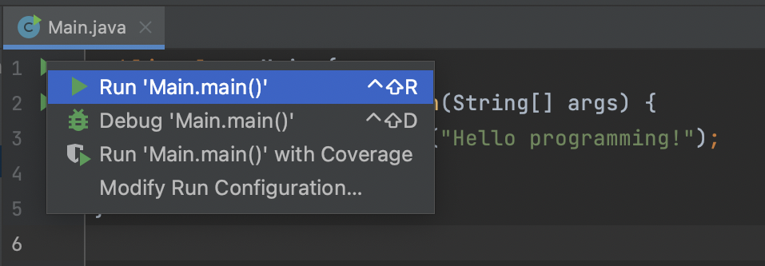

Шаг 20: 

Шаг 21: Нажмите на зелёную стрелку на первой строке, выберите "Run 'Main.main()'":

Шаг 22: Удостоверьтесь, что вывод программы соответствует скриншоту:

Поздравляем! Вы успешно установили IntelliJ IDEA и запустили первое Java-приложение.

